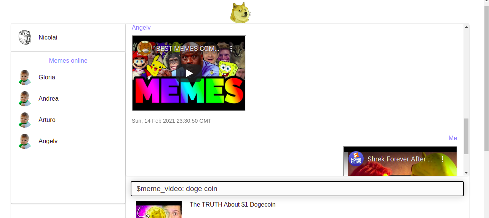
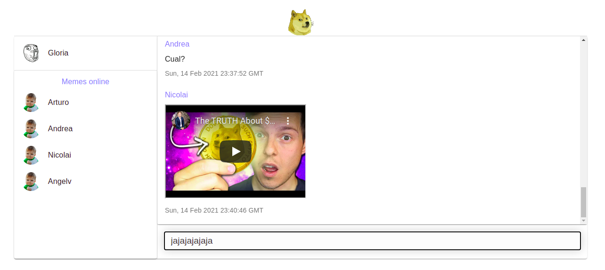

# Meme chat

# 

## Description :book:

Meme chat is an Internet Relay Chat using Node.js. This service lets you communicate in real-time with your friends. You also can share youtube videos in the chat.

## Installation :floppy_disk:

In Ubuntu:

- Install node.js and npm:

```console
foo@bar:~$ sudo apt update
foo@bar:~$ sudo apt install nodejs npm -y
```

- Inside the meme-chat folder go to the backend folder and install all the needed dependencies:

```console
foo@bar:~/meme-chat$ cd backend
foo@bar:~/meme-chat/backend$ npm install
```

- Execute the backend service:

```console
foo@bar:~/meme-chat/backend$ npm start
```

- Go back to the meme_chat folder and go to frontend folder and install all the needed dependencies:

```console
foo@bar:~/meme-chat$ cd frontend
foo@bar:~/meme-chat/frontend$ npm install
```

- Execute the frontend service:

```console
foo@bar:~/meme-chat/frontend$ npm start
```
- Note1: the backend runs in host 0.0.0.0, port 5000 by default.
- Note2: the frontend runs in host 0.0.0.0 port 3000 by default.

## Usage :open_file_folder:

0. Signin on memechat setting your nickname and your password
 
1. Login on memechat with you credentials in the service
 
2. Start to chat with your friend connected
 
3. Watch videos that your friends sent you
 
4. Send videos to your friends
 
- Note: to share videos, you must type the following command and press the Enter key: "/ youtube word_to_search", without the double comma. Example: / youtube memes. Once you have chosen the meme to send, you must click on it to send it through the chat.

## Support :email:

LinkedIn:

- [Arturo Victoria Rincon](https://www.linkedin.com/in/arturovictoriar/)

Twitter:

- [Arturo Victoria Rincon](https://twitter.com/arturovictoriar)

Portfolio website:

- [Arturo Victoria Rincon](http://arturovictoriar.github.io/)

## Authors and acknowledgment :school:

Arturo Victoria Rincon is Mechatronics Engineer with innate leadership and adaptability skills. Focused on developing software to improve people's quality of life using tools such as Python, Javascript, C, and C ++.

## License :warning:

:copyright: 2021 All rights reserved.

## Project status :white_check_mark:

This is an MVP and it handles just 1 channel. It does not reconnect automaticly. The number of message per second is depend on your system. It does not handle db.

## Author :black_nib:

* **Arturo Victoria Rincon** [@arturovictoriar](https://github.com/arturovictoriar)
