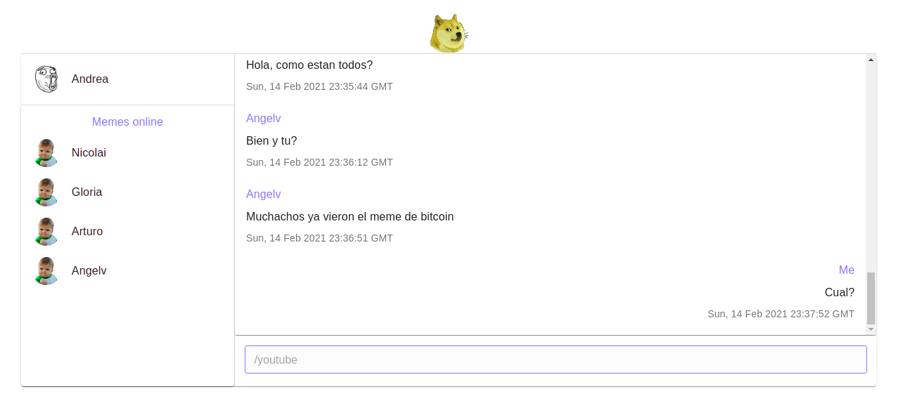

# Meme chat

# 

## Description :book:

Meme chat is an Internet Relay Chat using Node.js. This service lets you communicate in real-time with your friends. You also can share youtube videos in the chat.

## Visuals :camera:

### 
### 
### 
### 
### 

## Installation :floppy_disk:

In Ubuntu:

- Install node.js and npm:

```console
foo@bar:~$ sudo apt update
foo@bar:~$ sudo apt install nodejs npm -y
```

- Inside the meme-chat folder go to the backend folder and execute the index.js:

```console
foo@bar:~/meme-chat$ cd backend
foo@bar:~/meme-chat/backend$ npm install
```

- Go back to the meme_chat folder and go to frontend folder and execute the index.js:

```console
foo@bar:~/meme-chat$ cd frontend
foo@bar:~/meme-chat/frontend$ npm install
```

## Usage :open_file_folder:

- Go inside the backend folder and executen the backend service:

```console
foo@bar:~/meme-chat/backend$ npm start
```

- Go inside the frontend folder and executen the frontend service:

```console
foo@bar:~/meme-chat/frontend$ npm start
```
- Note1: the backend runs in port 5000.
- Note2: the frontend runs in port 3000.

## Support :email:

LinkedIn:

- [Arturo Victoria Rincon](https://www.linkedin.com/in/arturovictoriar/)

## Project status :white_check_mark:

This is the first MVP for this projects and it handles 1 channel. It does not reconnect automaticly.

## Author :black_nib:

* **Arturo Victoria Rincon** [@arturovictoriar](https://github.com/arturovictoriar)
